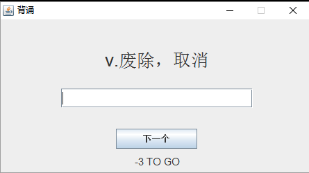

<table>
<tr>
<th>对应测试用例</th>
<th>Bug重现场景</th>
<th>Bug表现形式</th>
<th>与Bug相关的需求</th>
</tr>

<tr>
<td>所有测试用例</td>
<td>
测试用例进行到“查看本次背单词统计信息”时
</td>

<td>
错误次数比实际应该显示的次数多1 
</td>

<td>
功能5: "一轮背单词在背完所设数量单词后结束,显示本次背单词的统计信息,包括所选词库名、所选单词数量、正确单词数、<b>错误单词数</b>、正确率,只需要表格形式展现。"
</td>
</tr>

<tr>
<td>所有测试用例</td>
<td>
测试用例进行到“重新打开程序，查看统计信息”，点击饼状图
</td>

<td>
<b>饼状图</b>全部词库已背单词情况未正确显示 
</td>

<td>
功能7.2: "多种表现形式:表格、饼图(当前词库及全部词库中已背单词正确与错误 的比例、当前词库及<b>全部词库</b>中已背单词数占单词总数的比例)、柱状图 (全部词库中已背单词数量及正确率)。"
</td>
</tr>

<tr>
<td>所有测试用例</td>
<td>
测试用例进行到“重新打开程序，查看统计信息”，点击饼状图
</td>

<td>
<b>柱状图</b>全部词库已背单词情况未正确显示 
</td>

<td>
功能7.2: "多种表现形式:表格、饼图(当前词库及全部词库中已背单词正确与错误 的比例、当前词库及全部词库中已背单词数占单词总数的比例)、<b>柱状图 (全部词库中已背单词数量及正确率)</b>。"
</td>
</tr>

<tr>
<td>P3</td>
<td>
测试用例进行到 “续背” 时
</td>

<td>
上次已经背完该词库，但续背单词并未从该词库的第一个开始，而是第二个
</td>

<td>
功能6: "提供续背功能,允许用户本次使用应用并续背的时候能够从上一次应用结束时候在所选词库中最后一个背过的单词的下一个单词开始,<b>如果单词本在上次使用时已经背诵完成,则从该词库的第一个单词重新开始</b>。"
</td>
</tr>

<tr>
<td>N4</td>
<td>
测试用例进行到 输入起始单词(清空输入), 选择"开始"时
</td>

<td>
输入不合法，但无法开始，没有出现提示信息，也没有默认从第一个开始
</td>

<td>
功能2: "用户开始时可以选择当前词库的起始单词,可以自己输入(有相应的自动匹配 备选单词提示),也可以从本词库第一个单词开始,也可以从上次结束时的单词开始。默认从第一个单词开始。<b>如果用户输入的单词不合法(不在相应词库 中),系统提示输入信息错误,并默认从第一个单词开始</b>。"
</td>
</tr>

<tr>
<td>N8 (2)</td>
<td>
测试用例进行到 续背，续背数量输入"-3“之后，选择 ”续背“
</td>

<td>
输入数量明显不合法，但却能够续背

</td>

<td>
功能3: "<b>用户开始时可以设定本次背单词的数量</b>,如果词库所剩单词数量不足用户选择 的单词数(起始位置至词库末尾的单词数小于用户选择单词数),系统显示相 关信息提示,并默认将背单词数设为词库剩下单词数。"
</td>
</tr>

</table>

